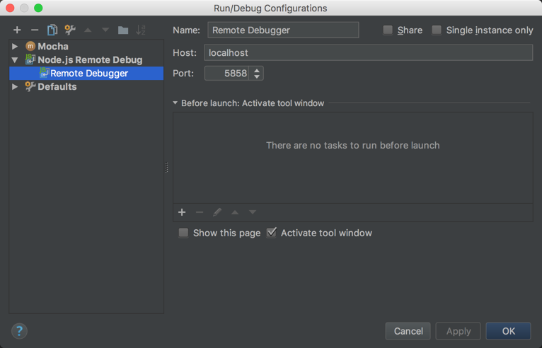
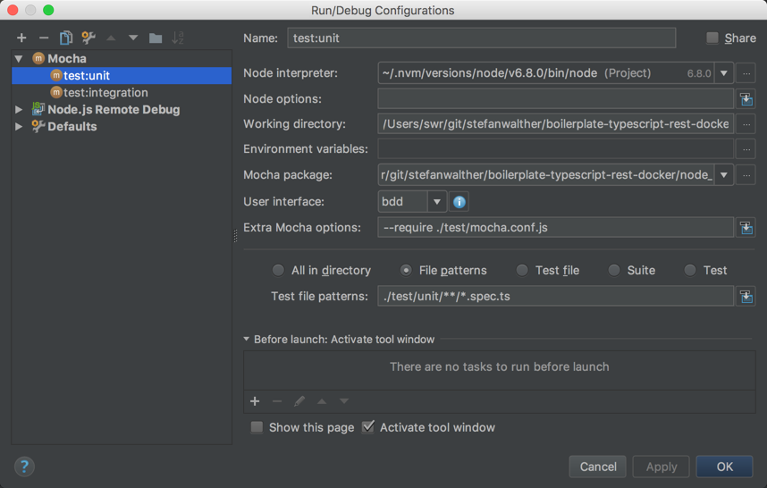
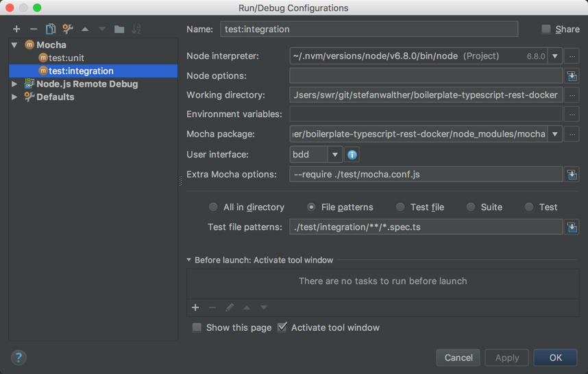
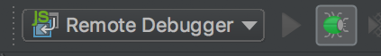
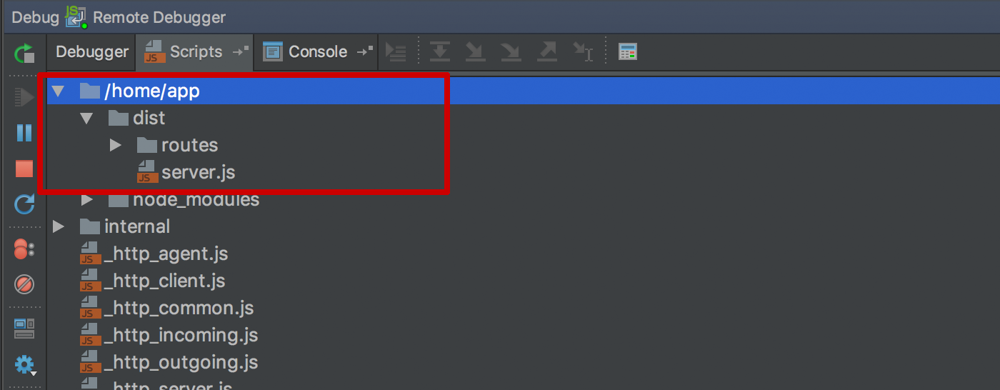
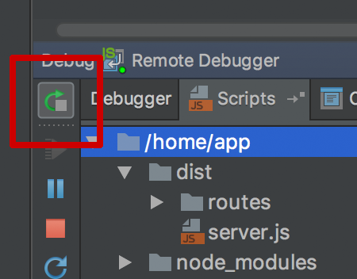
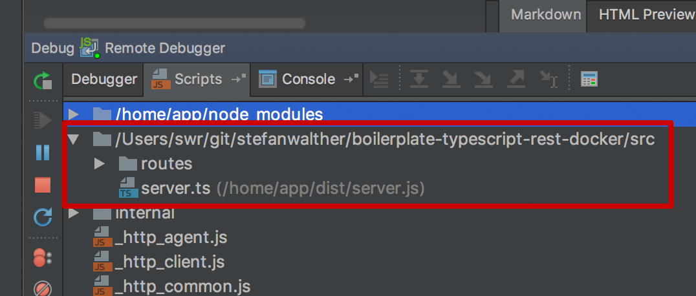
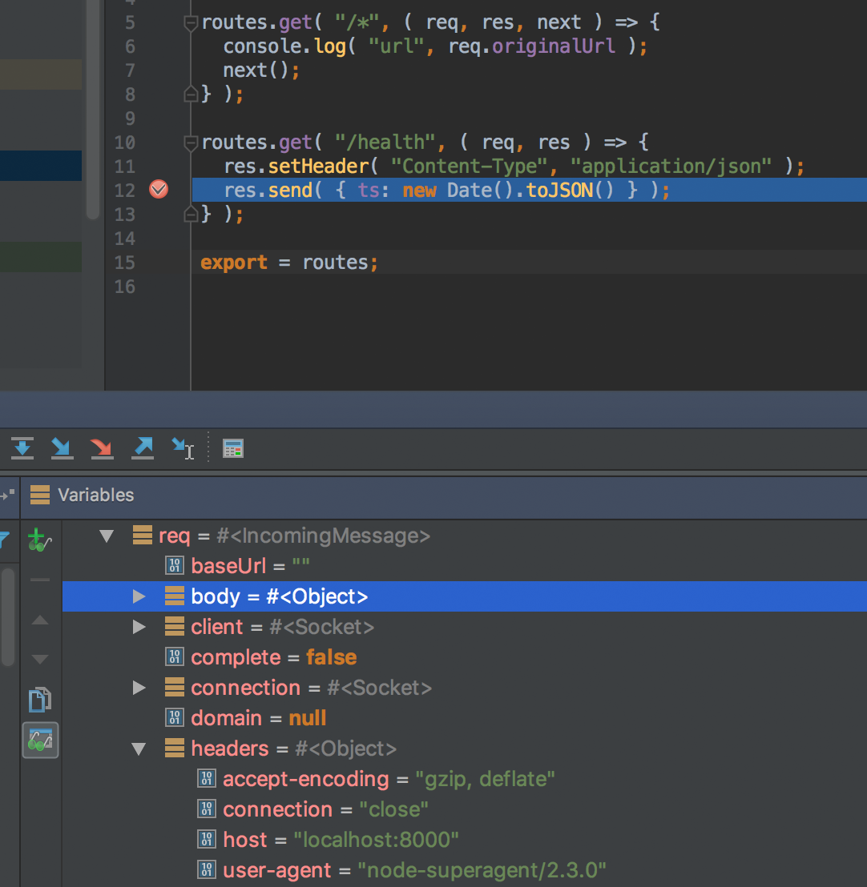

# boilerplate-typescript-rest-docker [](https://travis-ci.org/stefanwalther/boilerplate-typescript-rest-docker)

> How to use TypeScript & Docker building a REST service with debugging enabled (e.g. WebStorm or VSCode).


## Installation

```sh
# Clone the directory
$ git clone https://github.com/stefanwalther/boilerplate-typescript-rest-docker

# Install the local dependencies
# - Not necessary if you just want to use/test the docker containers

$ npm install
```

Install [Node.js Remote Intepreter Plugin](https://plugins.jetbrains.com/plugin/8116-node-js-remote-interpreter/) for IntelliJ/Webstorm

## The Development Workflow

The development environment contains the following:  

- A docker container called `rest-service` containing the REST server as defined in `./src`.  
- The REST services is exposed at `http://localhost:8000`.  
- Watcher (using [nodemon]()http://nodemon.io/ ): As soon as you make changes to the `./src` folder, the TypeScript files will be transpiled again and the server restarted.
  - So you can run your integration tests against your local `rest-service` container, which is after any change immediately up to date.
- Remote debugging enabled through port `5858`.  

## Run the Development Environment

```sh
$ docker-compose --f=./docker/docker-compose.dev.yml up
```

This will give you all of the above described.

## Debugging in WebStorm

Assuming that rest-service itself could rely on other services it makes sense just to spin up the development environment:

```sh
$ docker-compose --f=./docker/docker-compose.dev.yml up
```

So you can run your integration tests against http://localhost8000
The `rest-service` will be updated every time you make updates to the `./src` folder.

If you want to debug the rest-service (e.g. when hitting integration tests against the `rest-service`) this is the configuration being used in this example:

*Create a remote debugger* 

- `./docker/docker-compose.dev.yml` opens the port `5858` for the debugger, so let's connect to it:



### Running Unit Tests

Running the unit test in this scenario is straight-forward, just configure WebStorm as follows.
(This will not use the container, just directly test the transpiled TypeScript code).



Most of the settings should be default, except:

- *Extra mocha options:* `--require ./test/mocha.conf.js`
- *Test file patterns:* `./test/unit/**/*.spec.ts`

### Hit the Debugger (That's the trick!!!)

If you want to debug the `rest-service` (running inside the container), follow these steps:

**1) Set up the remote debugger as shown above**  
**2) Run the development environment** 
`docker-compose --f=./docker/docker-compose.dev.yml up`
  
**3) Set up the integration tests in Mocha:**  

The configuration is very similar to the unit tests:



- *Extra mocha options:* `--require ./test/mocha.conf.js`
- *Test file patterns:* `./test/integration/**/*.spec.ts`

**4) Start your "Remote Debugger"**



Here come the trick. If you don't see your `./*.ts` files (as in the screenshot below), then the sourcemaps as created by `tsc` have not been resolved by WebStorm. (That's a bug and I'll file it as such).



There's a neat trick, though a bit annoying, but i works:

Just press the "Re-Run Debugger" icon, and then you should see the `./*.ts` files as in the second following screenshot.






Once this works you can hit any breakpoint in the `rest-service` (e.g. by running `test:integration` in `Run` mode) and it will be hit:





## Continuous Integration

To simulate the Continuous Integration script run the following

```sh
$ bash ./docker/docker-ci.sh
```

An example how to implement CI using travis is provided, have a look at the `.travis.yml` file and the [result](https://travis-ci.org/stefanwalther/boilerplate-typescript-rest-docker/) .


## Credits

This solutions is very much inspired by the following two articles:

- https://hharnisc.github.io/2016/06/19/integration-testing-with-docker-compose.html
- https://medium.com/@creynders/debugging-node-apps-in-docker-containers-through-webstorm-ae3f8efe554d#.mplfu74fz

Another very interesting read in that context:

- https://blog.hospodarets.com/nodejs-debugging-in-chrome-devtools

